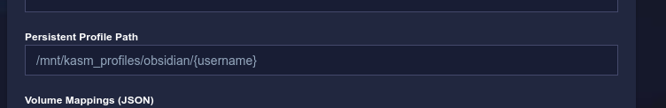

# Kasm Workspaces

This repository holds all my personally created and used Kasm workspaces that I did not find anywhere else available. It is also part of a tutorial released on my blog.

## Workspaces

### Obsidian

A workspace for the obsidian app.
To enable persistence in the vault, enable persistent_profiles in the Workspace configuration.

### Slack

A workspace for the slack desktop app.
